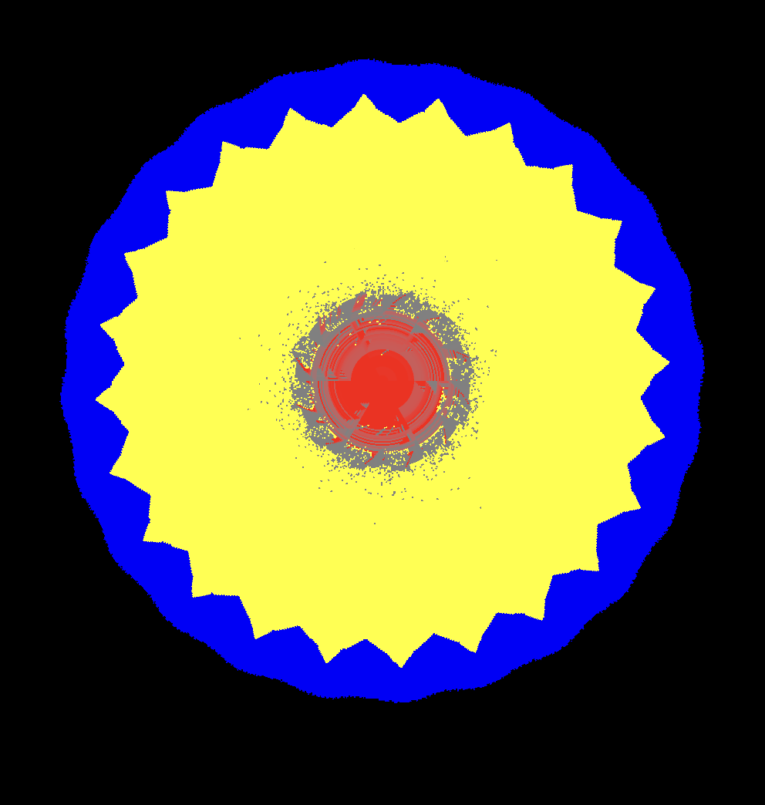
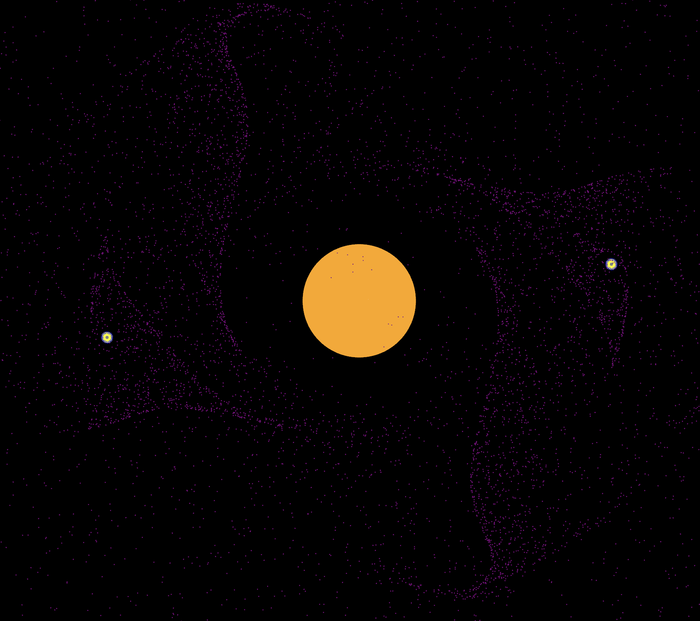

# OrbitingSandRust

A resource management and mining game simulating a realistic solar system economy.

# Sand

Planets are circular falling sand simulations taking place on a radial grid that geometrically gets larger as it gets further from the center (like an onion).

The grid is drawn onto a texture which is projected onto a mesh which is generated proceedurally.

Every frame a random sample of pixels are updated.



# Orbits

Orbits should be offloadable into memory so that we can support thousands of simultanous orbiting bodies that may crash into each other at any moment

However, they also are still simple kepler orbits. Not N body.



# Inspirations

* [Noita](https://www.youtube.com/watch?v=prXuyMCgbTc) - A falling sand on steriods game that proves the concept is possible.
* [Issac Arthur](https://www.youtube.com/watch?v=4CLplpekAug) - Tons of far future ideas to inspire the game.
* [Bobiverse](https://www.amazon.com/Are-Legion-Bob-Bobiverse-Book-ebook/dp/B01LWAESYQ) - Be a space probe, explore the galaxy, harvest resources, replicate.
* [Mindustry](https://github.com/Anuken/Mindustry) - A perfect example of open source in game development.
* [Factorio](https://www.factorio.com/) - Obviously the father of all modern resource management games.
* [Dwarf Fortress](https://www.bay12games.com/dwarves/) - A game that simulates everything and is the long term passion of good designer.

## Lots of Links

* [Kurzgesagt](https://www.youtube.com/@kurzgesagt)
    * [How To Terraform Mars - WITH LASERS](https://youtu.be/HpcTJW4ur54)
    * [How To Terraform Venus (Quickly)](https://www.youtube.com/watch?v=G-WO-z-QuWI&t=523s)
    * [How We Could Build a Moon Base TODAY – Space Colonization 1](https://www.youtube.com/watch?v=NtQkz0aRDe8)
    * [Building a Marsbase is a Horrible Idea: Let’s do it!](https://www.youtube.com/watch?v=uqKGREZs6-w)
    * [Unlimited Resources From Space – Asteroid Mining](https://www.youtube.com/watch?v=y8XvQNt26KI&t=402s)
    * [How to Move the Sun: Stellar Engines](https://www.youtube.com/watch?v=v3y8AIEX_dU)
* [Issac Arthur](https://www.youtube.com/@isaacarthurSFIA)

# Platform Choices

## Why not use an engine

There is no way that most engines could handle the custom physics of this game. Also, most of the games that inpsired this game have custom raw code engines.

## Reasons for Moving to Rust from C++

1. Multiprocessing - We need a A LOT of parallelism to make this work. Rust is a great language for this.
2. ECS - Without an engine, we need an ecs to impose some structure on our code. Rust has great ECS libraries.
3. No Cmake - Need I say more?

## Reaons for first moving to GGEZ

* I tried godot C#, it didn't have good testing support and I felt it would be too slow or need too many modifications
* I tried raylib C++, and it didn't have support for a lot of mesh indices
* I tried rust macroquad, and it didn't have good mesh support
* Ggez has a lot of support for meshes, uses wgpu and other existing libraries, is 2D native and is based on LOVE. Really a match made in heaven.

## Reasons for moving from GGEZ to Bevy

* I needed an ECS
* Many things provided that are already integrated into the ECS

## Challenges with Rust

1. We are not going to use Bevy because it is so alpha. Many of our libraries are alpha.
2. Bindings - We need to bind to liquidfun, which will be a pain.
3. Major refactors are a lot of work due to the borrow checker, but at least its always safe

# Installation

## Ubuntu

```
sudo apt update

# The pkg-config command could not be found.
sudo apt install pkg-config

# could not find system library 'alsa' required by the 'alsa-sys' crate
sudo apt install libasound2-dev

# could not find system library 'libudev' required by the 'libudev-sys' crate
sudo apt install libusb-1.0-0-dev libftdi1-dev
sudo apt install libudev-dev

# Test the code
cargo test

# Benchmark the code
cargo bench

# Now run your code
cargo run

# Install Pre-Commit Hooks
# pip install pre-commit  # Use the pip of your choice
pre-commit install

# OPTIONAL: Install perf and https://github.com/flamegraph-rs/flamegraph for profiling
sudo apt install linux-tools-common linux-tools-generic linux-tools-`uname -r`
cargo install flamegraph
cargo flamegraph
```

# Statement on Open Source

The code provided is both free as in beer and free as in speech. You may use it for any purpose, including commercial. There are many games that can be created from these core physics components, and many games have had to recreate them. I want this to be a good starting point for any developer wanting these elements in their games.

Open Source is a trend I would love to see take off in game development. One of my favorite games, [Mindustry](https://github.com/Anuken/Mindustry) proves the open-source model works
for game development. That is why we are provided under the GPL rather than a more permissive license. We hope whatever you make with this code will also be open source.

Open Source allows a game to live past its prime, allows developers to do whatever they want with it (far beyond simple mods), improves the quality of the code, improves consumer engagement, and honestly is a lot more fun for the developers as it brings them closer to their community and shuns the corporate model of game development.

More than modding, open source allows forking. Please do this. Please make great things.

# Statement on Governance

I intend to start an OpenCollective so that I can pay contributors as well. I intend to profit share with any substantial contributors.

All donations to this game and all proceeds from stores, sponsors, and donations, will be cataloged and made public. I will also provide a breakdown of how the money is spent.

Feedback from the community is highly valued, but governance rests in the code owners. Forking is encouraged.

# Statement on Commercialization

I intend to commercialize this version of the game in the future. I intend to take sponsors, and donations, and sell it on GoG, Steam, and wherever else I can.

A trademark will be filed. Do not violate the trademark in downstream forks.

The code for this game will always be free. However, we will be making money off of binary distribution. This means if you are tech-savvy enough to compile the game, and that is worth your time, you can play the game for free. Hopefully, this also means you are tech-savvy enough to contribute!

Due to this commercialization strategy, I humbly ask other developers that you do not distribute verbatim (or near verbatim) binaries, and that consumers not consume verbatim binaries. The above is not a statment of license. It is merely a request.

Open Source in game development only works when the community supports the developers. Please support this project! If you make a derivative work, please support the original developers as well!